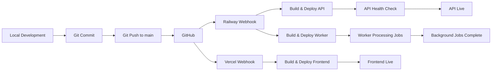

# FOLKIFY Backend Deployment Guide

This guide walks you through deploying the FOLKIFY backend API to Railway, frontend to Vercel, and managing the complete deployment workflow.

## Table of Contents

1. [Prerequisites](#prerequisites)
2. [GitHub Repository Setup](#github-repository-setup)
3. [Railway Backend Deployment](#railway-backend-deployment)
4. [Vercel Frontend Deployment](#vercel-frontend-deployment)
5. [Environment Variables Configuration](#environment-variables-configuration)
6. [Database Migration Deployment](#database-migration-deployment)
7. [Deployment Workflow](#deployment-workflow)
8. [Monitoring and Logging](#monitoring-and-logging)

---

## Prerequisites

Before starting the deployment process, ensure you have:

### Required Accounts

- **GitHub Account**: For version control and deployment triggers
  - Sign up at: https://github.com/signup
- **Railway Account**: For backend API and worker deployment
  - Sign up at: https://railway.app/
  - Connect your GitHub account during signup
- **Vercel Account**: For frontend deployment
  - Sign up at: https://vercel.com/signup
  - Connect your GitHub account during signup
- **Supabase Account**: For PostgreSQL database (should already be configured)
  - Access your project at: https://app.supabase.com/

### Required Tools

- Git installed locally
- Node.js 20.x or higher
- npm or yarn package manager
- Access to your Supabase project credentials

---

## GitHub Repository Setup

### Step 1: Create GitHub Repository

1. Go to https://github.com/new
2. Enter repository name: `folkify` (or your preferred name)
3. Choose visibility: Private (recommended) or Public
4. Do NOT initialize with README (we'll push existing code)
5. Click "Create repository"

### Step 2: Initialize Local Repository

```bash
# Navigate to your project root
cd /path/to/folkify

# Initialize git (if not already initialized)
git init

# Add all files
git add .

# Create initial commit
git commit -m "Initial commit: FOLKIFY backend and frontend"

# Add remote origin (replace with your repository URL)
git remote add origin https://github.com/YOUR_USERNAME/folkify.git

# Push to GitHub
git branch -M main
git push -u origin main
```

### Step 3: Verify .gitignore

Ensure your `.gitignore` file excludes sensitive files:

```gitignore
# Dependencies
node_modules/

# Environment variables
.env
.env.*
!.env.example

# Build outputs
dist/
build/

# Logs
logs/
*.log

# Uploads
uploads/

# Coverage
coverage/

# Sensitive files
*.pem
*.key
```

### Step 4: Protect Main Branch (Optional but Recommended)

1. Go to your repository on GitHub
2. Navigate to Settings → Branches
3. Add branch protection rule for `main`
4. Enable "Require pull request reviews before merging"
5. Enable "Require status checks to pass before merging"

---

## Railway Backend Deployment

### Step 1: Create Railway Project

1. Log in to https://railway.app/
2. Click "New Project"
3. Select "Deploy from GitHub repo"
4. Authorize Railway to access your GitHub account
5. Select your `folkify` repository
6. Railway will create a new project

### Step 2: Configure API Service

1. In your Railway project, click "New Service"
2. Select "GitHub Repo" → Choose your repository
3. Configure the service:
   - **Service Name**: `folkify-api`
   - **Root Directory**: `folkify_BE`
   - **Branch**: `main`

4. Railway will automatically detect the Node.js environment

### Step 3: Add Railway Configuration

The `railway.json` file in `folkify_BE/` directory configures the build and deployment:

```json
{
  "$schema": "https://railway.app/railway.schema.json",
  "build": {
    "builder": "NIXPACKS",
    "buildCommand": "npm install && npm run build && npx prisma generate"
  },
  "deploy": {
    "startCommand": "npx prisma migrate deploy && npm start",
    "healthcheckPath": "/api/health",
    "healthcheckTimeout": 300,
    "restartPolicyType": "ON_FAILURE",
    "restartPolicyMaxRetries": 10
  }
}
```

This configuration:

- Installs dependencies and builds TypeScript
- Generates Prisma client
- Runs database migrations before starting
- Starts the API server
- Monitors health at `/api/health`
- Automatically restarts on failure

### Step 4: Provision Redis Service

1. In your Railway project, click "New Service"
2. Select "Database" → "Redis"
3. Railway will provision a Redis instance
4. Note the connection details (automatically available as environment variables)

### Step 5: Configure Worker Service

The worker service processes background jobs asynchronously (AI grading, email notifications) using BullMQ queues. It runs as a separate Railway service but shares the same codebase, database, and Redis instance as the API service.

#### Why a Separate Worker Service?

- **Isolation**: Background jobs don't impact API response times
- **Scalability**: Scale workers independently based on queue load
- **Reliability**: Worker crashes don't affect API availability
- **Resource Management**: Allocate different resources to API vs workers

#### Worker Service Setup

1. In your Railway project, click "New Service"
2. Select "GitHub Repo" → Choose your repository
3. Configure the service:
   - **Service Name**: `folkify-worker`
   - **Root Directory**: `folkify_BE`
   - **Branch**: `main`

4. Override the start command:
   - Go to service Settings → Deploy
   - Set **Start Command**: `npm run start:worker`
   - This runs `node dist/worker.js` instead of the API server

5. Configure restart policy:
   - Go to service Settings → Deploy
   - **Restart Policy**: `ON_FAILURE` (automatically restart on crash)
   - **Max Retries**: `10` (maximum restart attempts)
   - Workers should automatically recover from transient failures

#### Shared Environment Variables

The worker service requires the same environment variables as the API service for database and Redis connectivity. Copy these variables from the API service:

**Required Variables**:

- `NODE_ENV=production`
- `DATABASE_URL` (pooled connection for queries)
- `DIRECT_URL` (direct connection for migrations)
- `REDIS_HOST=${{Redis.RAILWAY_PRIVATE_DOMAIN}}`
- `REDIS_PORT=6379`
- `REDIS_PASSWORD=` (if Redis has authentication)
- `LOG_LEVEL=info`
- `QUEUE_RETRY_ATTEMPTS=3`
- `QUEUE_RETRY_DELAY=2000`

**Not Required for Worker**:

- `PORT` (worker has no HTTP server)
- `FRONTEND_URL` (no CORS needed)
- `MAX_AUDIO_SIZE`, `MAX_VIDEO_SIZE` (no file uploads)
- `RATE_LIMIT_*` (no HTTP endpoints)
- `CACHE_TTL_*` (no caching layer)
- `JWT_SECRET` (no authentication)

#### Worker Monitoring and Logging

**Access Worker Logs**:

1. Go to Railway dashboard → Select `folkify-worker` service
2. Click "Logs" tab to view real-time logs
3. Monitor for job processing activity and errors

**What to Monitor**:

- Job processing success/failure rates
- Queue backlog size (jobs waiting to be processed)
- Worker restart frequency
- Memory usage (workers can be memory-intensive for AI processing)
- Processing time per job

**Check Worker Health**:

```bash
# Using Railway CLI
railway logs --service folkify-worker

# Follow logs in real-time
railway logs --service folkify-worker --follow
```

**Expected Log Output**:

```
Worker started successfully
Connected to Redis at redis://...
Processing job: aiGrading-12345
AI grading completed for submission 12345
Processing job: email-67890
Email sent successfully to user@example.com
```

#### Worker Job Queues

The worker processes jobs from two BullMQ queues:

1. **AI Grading Queue** (`aiGrading`):
   - Processes audio/video submissions
   - Runs AI analysis (mock implementation)
   - Updates submission records with scores
   - Retry: 3 attempts with 2-second delay

2. **Email Queue** (`email`):
   - Sends notification emails
   - Currently logs to console (EMAIL_MODE=console)
   - Can be configured for real email service
   - Retry: 3 attempts with 2-second delay

#### Troubleshooting Worker Issues

**Worker Not Processing Jobs**:

1. Check worker service is running in Railway dashboard
2. Verify Redis connection (check `REDIS_HOST` and `REDIS_PORT`)
3. Check worker logs for connection errors
4. Restart worker service manually if needed

**Jobs Stuck in Queue**:

1. Check Redis queue status using Redis CLI
2. Verify worker service is running
3. Check for job processing errors in logs
4. Clear stuck jobs if necessary (see TROUBLESHOOTING.md)

**Worker Crashes Repeatedly**:

1. Check logs for error messages
2. Verify environment variables are correct
3. Check memory usage (may need to increase allocation)
4. Review recent code changes that might cause crashes

See [TROUBLESHOOTING.md](./TROUBLESHOOTING.md) for detailed worker troubleshooting procedures.

### Step 6: Configure Environment Variables

See [Environment Variables Configuration](#environment-variables-configuration) section below.

### Step 7: Deploy Services

1. Railway will automatically deploy all services on first setup:
   - API service (with public URL)
   - Worker service (internal, no public URL)
   - Redis service (internal)

2. Monitor deployment logs in the Railway dashboard for each service

3. Wait for API health checks to pass

4. Verify worker service is running and processing jobs (check logs)

5. Note the public URL for your API service (e.g., `https://folkify-api.railway.app`)

---

## Vercel Frontend Deployment

### Step 1: Create Vercel Project

1. Log in to https://vercel.com/
2. Click "Add New" → "Project"
3. Import your GitHub repository
4. Select the `folkify` repository

### Step 2: Configure Build Settings

1. **Framework Preset**: Select your framework (Vite, Next.js, React, etc.)
2. **Root Directory**: `folkify_main_FE`
3. **Build Command**: `npm run build` (or framework-specific command)
4. **Output Directory**: `dist` (or `build` for Create React App)
5. **Install Command**: `npm install`

### Step 3: Add Vercel Configuration

Create `vercel.json` in your frontend directory:

```json
{
  "version": 2,
  "buildCommand": "npm run build",
  "outputDirectory": "dist",
  "framework": "vite",
  "env": {
    "VITE_API_URL": "@api-url-production"
  },
  "headers": [
    {
      "source": "/(.*)",
      "headers": [
        {
          "key": "X-Content-Type-Options",
          "value": "nosniff"
        },
        {
          "key": "X-Frame-Options",
          "value": "DENY"
        },
        {
          "key": "X-XSS-Protection",
          "value": "1; mode=block"
        }
      ]
    }
  ],
  "rewrites": [
    {
      "source": "/(.*)",
      "destination": "/index.html"
    }
  ]
}
```

### Step 4: Configure Environment Variables

1. In Vercel project settings, go to "Environment Variables"
2. Add the following variable:
   - **Key**: `VITE_API_URL`
   - **Value**: Your Railway API URL (e.g., `https://folkify-api.railway.app`)
   - **Environments**: Production, Preview, Development

### Step 5: Deploy Frontend

1. Click "Deploy"
2. Vercel will build and deploy your frontend
3. Monitor build logs for any errors
4. Note your Vercel domain (e.g., `https://folkify.vercel.app`)

### Step 6: Update Railway CORS Configuration

1. Go back to Railway API service
2. Update the `FRONTEND_URL` environment variable with your Vercel domain
3. Railway will automatically redeploy

---

## Environment Variables Configuration

### Railway API Service Variables

Configure these in Railway dashboard → API Service → Variables:

```bash
# Node Environment
NODE_ENV=production
PORT=3000

# Supabase Configuration
SUPABASE_PROJECT_ID=<your-project-id>
SUPABASE_PROJECT_URL=https://<project-id>.supabase.co
SUPABASE_ANON_KEY=<your-anon-key>

# Database Connections
# Pooled connection (port 6543) for runtime queries
DATABASE_URL=postgresql://postgres.<project-ref>:<password>@aws-0-<region>.pooler.supabase.com:6543/postgres?pgbouncer=true

# Direct connection (port 5432) for migrations
DIRECT_URL=postgresql://postgres.<project-ref>:<password>@aws-0-<region>.pooler.supabase.com:5432/postgres

# Redis (Auto-configured by Railway)
REDIS_HOST=${{Redis.RAILWAY_PRIVATE_DOMAIN}}
REDIS_PORT=6379
REDIS_PASSWORD=

# JWT Configuration
JWT_SECRET=<generate-secure-32-char-minimum>
JWT_ACCESS_EXPIRATION=15m
JWT_REFRESH_EXPIRATION=7d

# CORS Configuration
FRONTEND_URL=https://<your-vercel-domain>.vercel.app

# File Upload Configuration
MAX_AUDIO_SIZE=52428800
MAX_VIDEO_SIZE=209715200

# Email Configuration
EMAIL_MODE=console

# Logging Configuration
LOG_LEVEL=info

# Rate Limiting
RATE_LIMIT_WINDOW_MS=900000
RATE_LIMIT_MAX_REQUESTS=100
AUTH_RATE_LIMIT_MAX_REQUESTS=5

# Cache Configuration (seconds)
CACHE_TTL_INSTRUMENTS=1800
CACHE_TTL_LESSONS=600
CACHE_TTL_SHEETS=1800
CACHE_TTL_ANALYTICS=300

# Cronjob Configuration
PREMIUM_EXPIRATION_CRON=0 0 * * *

# BullMQ Configuration
QUEUE_RETRY_ATTEMPTS=3
QUEUE_RETRY_DELAY=2000
```

### Railway Worker Service Variables

The worker service needs these variables (copy from API service):

```bash
NODE_ENV=production
DATABASE_URL=<same-as-api>
DIRECT_URL=<same-as-api>
REDIS_HOST=${{Redis.RAILWAY_PRIVATE_DOMAIN}}
REDIS_PORT=6379
REDIS_PASSWORD=
LOG_LEVEL=info
QUEUE_RETRY_ATTEMPTS=3
QUEUE_RETRY_DELAY=2000
```

### Vercel Frontend Variables

Configure in Vercel dashboard → Project Settings → Environment Variables:

```bash
VITE_API_URL=https://<railway-api-domain>.railway.app
```

### Getting Supabase Credentials

1. Go to https://app.supabase.com/
2. Select your project
3. Go to Settings → Database
4. Copy the connection strings:
   - **Connection pooling** (port 6543) → Use for `DATABASE_URL`
   - **Direct connection** (port 5432) → Use for `DIRECT_URL`
5. Go to Settings → API
6. Copy the `anon` `public` key → Use for `SUPABASE_ANON_KEY`

### Generating JWT Secret

Generate a secure JWT secret (minimum 32 characters):

```bash
node -e "console.log(require('crypto').randomBytes(32).toString('hex'))"
```

Copy the output and use it as your `JWT_SECRET`.

---

## Database Migration Deployment

### How Migrations Work

The Railway deployment automatically runs database migrations before starting the API:

1. Railway builds the application
2. Generates Prisma client
3. Runs `npx prisma migrate deploy` (uses `DIRECT_URL`)
4. Starts the API server (uses `DATABASE_URL`)

### Migration Process

**Automatic Deployment**:

- Migrations in `prisma/migrations/` are automatically applied
- If migration fails, deployment stops (server won't start)
- Previous version remains active until successful deployment

**Manual Migration** (if needed):

```bash
# Connect to Railway service
railway link

# Run migrations manually
railway run npx prisma migrate deploy

# Or use Prisma Studio to inspect database
railway run npx prisma studio
```

### Creating New Migrations

1. Develop migration locally:

   ```bash
   cd folkify_BE
   npx prisma migrate dev --name your_migration_name
   ```

2. Test migration locally against Supabase staging database

3. Commit migration files:

   ```bash
   git add prisma/migrations/
   git commit -m "Add migration: your_migration_name"
   git push origin main
   ```

4. Railway automatically deploys and applies migration

### Migration Troubleshooting

If migration fails during deployment:

1. Check Railway deployment logs for error details
2. Verify migration SQL in `prisma/migrations/`
3. Test migration locally
4. Fix issues and push corrected migration
5. Railway will retry deployment automatically

See [TROUBLESHOOTING.md](./TROUBLESHOOTING.md) for detailed migration error resolution.

---

## Deployment Workflow

### Continuous Deployment

Both Railway and Vercel are configured for automatic deployment:



### Standard Deployment Process

1. **Develop locally**:

   ```bash
   cd folkify_BE
   npm run dev
   ```

2. **Test changes**:

   ```bash
   npm test
   npm run lint
   ```

3. **Commit changes**:

   ```bash
   git add .
   git commit -m "Description of changes"
   ```

4. **Push to GitHub**:

   ```bash
   git push origin main
   ```

5. **Automatic deployment**:
   - Railway detects push and starts building
   - Vercel detects push and starts building
   - Monitor deployment in respective dashboards

6. **Verify deployment**:
   - Check Railway health checks pass
   - Test API endpoints
   - Test frontend functionality
   - See [DEPLOYMENT_VERIFICATION.md](./DEPLOYMENT_VERIFICATION.md)

### Preview Deployments (Vercel)

Vercel automatically creates preview deployments for pull requests:

1. Create feature branch:

   ```bash
   git checkout -b feature/new-feature
   ```

2. Make changes and push:

   ```bash
   git push origin feature/new-feature
   ```

3. Create pull request on GitHub

4. Vercel automatically deploys preview:
   - Unique URL for testing
   - Isolated from production
   - Automatically updated on new commits

5. Test preview deployment before merging

### Rollback Procedures

See [TROUBLESHOOTING.md](./TROUBLESHOOTING.md) for detailed rollback procedures.

**Quick Rollback**:

**Railway**:

1. Go to Railway dashboard → Service → Deployments
2. Find last known good deployment
3. Click "Redeploy"

**Vercel**:

1. Go to Vercel dashboard → Deployments
2. Find last known good deployment
3. Click "..." → "Promote to Production"

---

## Monitoring and Logging

### Railway Monitoring

**Access Logs**:

1. Go to Railway dashboard
2. Select your project
3. Click on service (API or Worker)
4. View real-time logs in the "Logs" tab

**Metrics**:

- CPU usage
- Memory usage
- Network traffic
- Request count
- Response times

**Health Checks**:

- Railway monitors `/api/health` endpoint
- Automatic restart on health check failure
- View health status in service dashboard

### Vercel Monitoring

**Access Logs**:

1. Go to Vercel dashboard
2. Select your project
3. Click "Deployments" → Select deployment
4. View build and runtime logs

**Analytics** (if enabled):

- Page views
- Unique visitors
- Performance metrics
- Web Vitals

### Application Logging

The API logs to stdout/stderr, which Railway captures:

**Log Levels**:

- `error`: Critical errors requiring attention
- `warn`: Warning messages
- `info`: General information (default)
- `debug`: Detailed debugging information

**Configure log level** via `LOG_LEVEL` environment variable.

**View logs**:

```bash
# Using Railway CLI
railway logs

# Follow logs in real-time
railway logs --follow
```

### Health Check Endpoint

Monitor API health at: `https://<your-api-domain>.railway.app/api/health`

**Response**:

```json
{
  "status": "healthy",
  "timestamp": "2024-01-15T10:30:00.000Z",
  "services": {
    "database": "healthy",
    "redis": "healthy"
  },
  "uptime": 3600,
  "version": "1.0.0"
}
```

### Alerts and Notifications

**Railway**:

- Configure webhooks for deployment events
- Integrate with Slack, Discord, or custom webhooks
- Settings → Integrations

**Vercel**:

- Email notifications for deployment status
- Integrate with Slack for deployment notifications
- Settings → Notifications

---

## Next Steps

After successful deployment:

1. ✅ Verify deployment using [DEPLOYMENT_VERIFICATION.md](./DEPLOYMENT_VERIFICATION.md)
2. ✅ Set up monitoring and alerts
3. ✅ Configure custom domains (optional)
4. ✅ Set up staging environment (optional)
5. ✅ Document any custom configuration
6. ✅ Train team on deployment process

## Support and Resources

- **Railway Documentation**: https://docs.railway.app/
- **Vercel Documentation**: https://vercel.com/docs
- **Supabase Documentation**: https://supabase.com/docs
- **Prisma Documentation**: https://www.prisma.io/docs
- **Troubleshooting Guide**: [TROUBLESHOOTING.md](./TROUBLESHOOTING.md)
- **Verification Checklist**: [DEPLOYMENT_VERIFICATION.md](./DEPLOYMENT_VERIFICATION.md)
